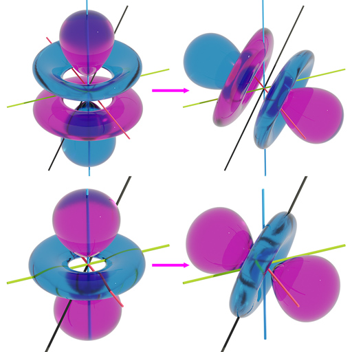

# Sphecerix


[](https://github.com/ifilot/sphecerix/actions/workflows/build.yml)
[](https://sphecerix.imc-tue.nl)
[](https://www.gnu.org/licenses/gpl-3.0)



**Figure**: Demonstration of rotating a spherical harmonic by means of the
Wigner D-matrix. In the above image, a 3dz2 and a 4fz3 atomic orbital are rotated
by an angle $`\pi`$ over an axis with coordinates $`(1,1,1)`$. Note that the image has
**not** been constructed by rotating the isosurfaces but by calculating the
scalar field after the rotation.

## Purpose
Rotation of spherical harmonics using Wigner-D matrices

## Background
The canonical spherical harmonics $`Y_{lm}`$ subject to a rotation in 
$`\mathbb{R}^{3}`$ will always mix among each other. As such, we can
represent the act of rotating the spherical harmonics by the following
matrix-vector equation

```math
\vec{Y}_{l}\prime = \mathbf{D}\vec{Y}_{l}
```

wherein $`\mathbf{D}`$ is the [Wigner D-matrix](https://en.wikipedia.org/wiki/Wigner_D-matrix)
and $`\vec{Y}_{l}`$ a vector composed of the canonical spherical harmonics
of order $`l`$. The vector $`\vec{Y}_{l}\prime`$ is the linear combination that
represents the result of the rotation upon the (linear combination) of
spherical harmonics prior to the rotation.

## Usage

In the script below, a dz2 spherical harmonic is rotated over an axis with
coordinates $`(1,1,1)`$ by an angle $`\pi`$. The result of this rotation is
a linear combination of spherical harmonics all with $`l=2`$.

```python
from sphecerix import tesseral_wigner_D
from scipy.spatial.transform import Rotation as R
import numpy as np

def main():
    # build rotation axis and set angle
    axis = np.ones(3) / np.sqrt(3)
    angle = np.pi
    Robj = R.from_rotvec(axis * angle)
    
    # construct tesseral Wigner D matrix
    D = tesseral_wigner_D(2, Robj)
    Y = np.zeros(5)
    Y[2] = 1
    
    # calculate linear combination of the spherical harmonics after rotation
    Yp = D @ Y
    print(Yp)
    
if __name__ == '__main__':
    main()
```